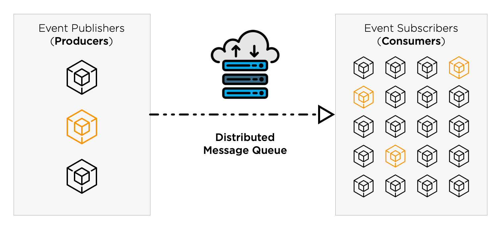

<p align="center">
    
</p>

---

SQS MEGA is a minimal and fault-tolerant framework for async processing, event-streaming and pattern-matching that uses [Amazon Simple Queue Service (SQS)](https://aws.amazon.com/sqs/). It also implements the → [**MEGA event protocol**](https://github.com/mega-distributed/event-mega). It has the following goals:

- Simplicity
- Resiliency
- Horizontal scalability
- Interoperability

It is ideal for event-driven **microservices** or **distributed systems** that need to communicate using the [**Publish-Subscribe**](https://en.wikipedia.org/wiki/Publish–subscribe_pattern) pattern or process background tasks. It leverages both the power and resiliency of Amazon SQS, packaged in a way that makes it simple to publish and subscribe to events or consume messages in the background using your platform of choice.

SQS MEGA implementations also have an idiomatic and expressive **pattern-matching** DSL that allows developers to subscribe to specific events and filter messages easily.

The framework can replace intricated setups or heavy tools that could be difficult to learn or configure correctly, such as [Celery](http://www.celeryproject.org), [ActiveMQ](https://activemq.apache.org), [Sidekiq](https://sidekiq.org), [Resque](http://resque.github.io), [delayed_job](https://github.com/collectiveidea/delayed_job/), or even [RabbitMQ](https://www.rabbitmq.com) and [Apache Kafka](https://kafka.apache.org). Amazon SQS standard queues scale automatically and offer at-least-once delivery assurances, combining the best of both worlds.

### Implementations

Shipping soon for:

- → [**Python**](https://github.com/mega-distributed/sqs-mega-python)
- Node.js
- Rust
- Ruby
- JVM

### Features

- Publish and consume data payloads and [MEGA events](https://github.com/mega-distributed/event-mega) over [Amazon SQS](https://aws.amazon.com/sqs/) or [Amazon SNS](https://aws.amazon.com/sns/).
- Subscribe to specific events and messages using an expressive **pattern-matching** DSL.
- Scale publisher and subscriber processes independently and at your heart's desire.
- SNS notifications delivered over SQS are decoded transparently.
- Data payloads can be automatically encoded and decoded using [Binary JSON (BSON)](http://bsonspec.org) to save network bandwidth.
- Messages that fail to be processed can be automatically retried.

---

## Table of Contents

- [Background](#background)
- [Amazon SQS](#amazon-sqs)
  * [Standard vs. FIFO queues](#standard-vs-fifo-queues)
  * [Anatomy of a SQS message](#anatomy-of-a-sqs-message)
- [Message payloads](#message-payloads)
    + [MEGA events](#mega-events)
    + [Data objects](#data-objects)
  * [Data serialization](#data-serialization)
    + [Raw plaintext and binary blobs](#raw-plaintext-and-binary-blobs)
- [Best practices for processing asynchronous messages](#best-practices-for-processing-asynchronous-messages)
  * [Design your application to be idempotent](#design-your-application-to-be-idempotent)
  * [Be prepared for messages out-of-order](#be-prepared-for-messages-out-of-order)
  * [Handle concurrency gracefully](#handle-concurrency-gracefully)
    + [Isolation and locking strategies for relational databases](#isolation-and-locking-strategies-for-relational-databases)
      - [PostgreSQL](#postgresql)
      - [MySQL](#mysql)
      - [MariaDB](#mariadb)
    + [When a relational database is not available](#when-a-relational-database-is-not-available)
  * [Retry transient failures](#retry-transient-failures)

## Background

<p align="center">
    
</p>

Different software processes typically communicate over packet networks, such as the Internet. For this communication to happen reliably, many protocols exist, but usually, they empower TCP or HTTP. A process that initiates the conversation (the _client_) sends a packet or request to another process (the _server_). The client expects an acknowledgment ("ACK") or response to be sent back on time. Otherwise, a **timeout** might happen.

The Internet is an unreliable packet network that binds together many networks of several kinds. When two hosts try to communicate, packets may get lost or fail to be delivered. Timeouts are the only mechanism that can determine when this happens and are an essential feature of the Internet. TCP automatically resends packets that take too long to be acknowledged, but after some time it gives up. Clients using the HTTP protocol, which runs over TCP, also expect the server to send a response within a specific time frame. If this response is not received, an application error occurs.

Therefore, any software process that serves requests must respond to its clients promptly, to the risk of raising timeouts. Heavy processing that might take a long time to complete must not be executed as part of the request. Instead, intensive computing tasks should be scheduled to be processed later, without requiring clients to wait. When processing finishes, it may notify the client. We call this **asynchronous** communication or processing.

Asynchronous communication is a powerful technique that can allow distributed-systems such as service-oriented architectures or microservices to be fault-tolerant and scale well. Under this paradigm, services communicate using **events**. A service _publishes_ an event to signal that something relevant happened; other services _subscribe_ to these events and react to them accordingly. This pattern is known as **event-streaming** or _Publish-Subscribe_. One benefit is that it decouples services that produce events from services that consume events, allowing for horizontal scalability. Since communication happens asynchronously, it is also more flexible and tolerant of transient errors such as network timeouts.

Another feature of asynchronous communication is to allow scheduling of intensive computations to be executed in the background by other processes. We typically call this scheduling a task or job. The processes that create tasks are known as _producers_; by analogy, the _consumers_ are processes that execute tasks asynchronously. This pattern is also known as _Producer-Consumer_.

For asynchronous communication to happen, usually, a **message queue** is empowered. Messages can represent anything, such as an event or task. A producer puts a message in the queue. On the other side, one or more consumers read the queue and perform computing accordingly. When computing finishes, the message is deleted. If the message remains in the queue, it will be read and processed again later, possibly by another process.

There are many available systems that can be used as a message queue. When these systems are distributed and [partition-tolerant](https://en.wikipedia.org/wiki/CAP_theorem), we call them _distributed queue_. Examples include [Redis](https://redis.io), [RabbitMQ](https://www.rabbitmq.com), [ZeroMQ](https://zeromq.org), [Apache Kafka](https://kafka.apache.org) and [Amazon SQS](https://aws.amazon.com/sqs). Here we are going to discuss the later.

## Amazon SQS

I find Amazon's [own definition](https://aws.amazon.com/sqs/) of SQS quite useful:

> Amazon Simple Queue Service (SQS) is a fully managed message queuing service that enables you to decouple and scale microservices, distributed systems, and serverless applications. SQS eliminates the complexity and overhead associated with managing and operating message oriented middleware, and empowers developers to focus on differentiating work. Using SQS, you can send, store, and receive messages between software components at any volume, without losing messages or requiring other services to be available.
>
> SQS offers two types of message queues. **Standard queues** offer maximum throughput, best-effort ordering, and at-least-once delivery. SQS **FIFO queues** are designed to guarantee that messages are processed exactly once, in the exact order that they are sent.

Please read the [Amazon SQS Developer Guide](https://docs.aws.amazon.com/AWSSimpleQueueService/latest/SQSDeveloperGuide/welcome.html) to get started.

### Standard vs. FIFO queues

Standard queue:

- _Unlimited Throughput_: Standard queues support a nearly unlimited number of transactions per second (TPS).
- _At-Least-Once Delivery_: A message is delivered at least once, but occasionally more than one copy of a message is delivered.
- _Best-Effort Ordering_: Occasionally, messages might be delivered in an order different from which they were sent.

<p align="center">
    
</p>

FIFO queue:

- _High Throughput_: By default, with batching, FIFO queues support up to 3,000 messages per second (TPS), per API action.
- _Exactly-Once Processing_: A message is delivered once and remains available until a consumer processes and deletes it. Duplicates aren't introduced into the queue.
- _First-In-First-Out Delivery_: The order in which messages are sent and received is strictly preserved.

<p align="center">
    
</p>

FIFO queues are more expensive to scale. For this reason, chose Standard queues unless your application explicitly requires exactly-once processing and preserving the order of messages. Most applications can live well without such requirements.

Design your application to be idempotent and have a source of truth that it can query synchronously. This way, even if you receive duplicate or out-of-order messages, the outcome remains the same.

### Anatomy of a SQS message

SQS Messages have the following structure:

- _Message ID_: globally unique identifier of the message
- _Receipt handle_: identifies the act of receiving a message. This is needed when deleting the message, in order to prevent that clients attempt to delete messages they didn't receive.
- _Body_: this is the actual message payload, can be anything and use any format.
- _MD5 of the body_: a MD5 computation of the message body, used to ensure the integrity of the message.

Example:

```xml
<Message>
    <MessageId>27062346-9c9a-435e-abc6-d991d13d5c90</MessageId>
    <ReceiptHandle>AQEBF2SjK3ztAC/9ANq/N6rVn9qGwl7BVbTkCqoni+LRjWe5wdbCOgGdKPgvYWFmUNuGRgwDIqfuY1o2fVGbDMwRPzMg2RHgjX6C5aiWSaaXefcGGRZaUtYEFLS4fWlMlyG1OWSxGoyR6Z+3bN/oSF+xTAOb25CojlDs7ZyYbfTqKXhYv/j8HloyVBpGN2bDAjI3TiFTtwcmDqHcBxge/YmOTCvFEFB8KMv3VT4JbnQXQYyi3FBCAEYgr/ddF+ZbbaRN7rjL6NWOfTUNFY7PocFG7BpIpfmFbdNH/LnlnOSY8S7tzLy+J6u++MCQLBuX99F3fRsEyB9bL8CEnPs4mRvCF4umNbonMgiXewsdZZQuI6vXvh6dOeJBalRCOoAQkrM1EtkS2UJuKUKpZ9VtlEBSQQ==</ReceiptHandle>
    <MD5OfBody>5b54d0d0dc65417f2aa0aae59b07492f</MD5OfBody>
    <Body>this is a message body</Body>
</Message>
```

Amazon SQS API uses XML as a data format to serialize the message attributes. However, the `Body` attribute can contain any string. We can use it to send data serialized in JSON format, as long as it is properly escaped.

So for example, if we want to send the following [JSON](https://www.json.org/json-en.html) payload:

```json
{
    "id": 543210,
    "name": "John Doe",
    "ssn": "453142161",
    "date_of_birth": "1986-12-01"
}
```

It will be serialized within the SQS message envelope as:

```xml
<Body>{&quot;id&quot;: 543210, &quot;name&quot;: &quot;John Doe&quot;, &quot;ssn&quot;: &quot;453142161&quot;, &quot;date_of_birth&quot;: &quot;1986-12-01&quot;}</Body>
```

## Message payloads

A message payload can be one of the following:

- [MEGA event](https://github.com/mega-distributed/event-mega)
- Data object
- Plaintext
- Binary blob

#### MEGA events

The [MEGA event protocol](https://github.com/mega-distributed/event-mega) aims to be a common protocol for all your event-streaming needs, regardless of platform. SQS MEGA supports MEGA events nativelly.

```json
{
    "protocol": "mega",
    "version": 1,
    "event": {
        "name": "user.updated",
        "timestamp": "2020-05-04T15:53:27.823",
        "version": 1,
        "domain": "user",
        "subject": "987650",
        "username": "john.doe",
        "attributes": {
            "email": "johndoe_86@example.com",
            "ssn": "497279436"
        }
    },
    "object": {
        "current": {
            "id": 987650,
            "full_name": "John Doe",
            "username": "john.doe",
            "email": "johndoe_86@example.com",
            "ssn": "497279436",
            "birthdate": "1986-02-15",
            "created_at": "2020-05-03T12:20:23.000",
            "updated_at": "2020-05-04T15:52:01.000"
        }
    }
}
```

#### Data objects

SQS MEGA can also publish, consume, and perform pattern-matching on any generic data objects.

```json
{
    "type": "user_notification",
    "notification_type": "email",
    "user": {
        "id": 987650,
        "email": "johndoe_86@example.com"
    }
}
```

### Data serialization

Currently, MEGA events or data objects can only be serialized to and from JSON format. Optionally, [Binary JSON (BSON)](http://bsonspec.org) can be used to compress messages over the network.

In the future, support for other data serialization formats, such as XML, could be added.

#### Raw plaintext and binary blobs

Because SQS messages can only be transmitted over plaintext media, binary content such as BSON or bytes will be automatically encoded by SQS MEGA using [Base64](https://en.wikipedia.org/wiki/Base64).

Any string that cannot be decoded as Base64 or JSON is considered plaintext with Unicode encoding. Similarly, any set of bytes encoded as Base64 that cannot be decoded as BSON will be considered a generic binary blob.

SQS MEGA gives message subscribers the ability to perform pattern-matching, but that only applies to MEGA events and data objects. If a message contains a plaintext payload that cannot be decoded as JSON or a binary payload that cannot be decoded as BSON, the framework allows you to either:

- Provide custom code to consume the plaintext or binary payload
- Provide custom code to transform the plaintext or binary payload to a data object, which then can have pattern-matching rules applied.
- Ignore the unrecognized plaintext or binary payload and delete the message from the queue (_default_).

## Best practices for processing asynchronous messages

### Design your application to be idempotent

From [Wikipedia](https://en.wikipedia.org/wiki/Idempotence):

> Idempotence is the property of certain operations in mathematics and computer science whereby they can be applied multiple times without changing the result beyond the initial application.

In the context of event-stream processing, it means that if your application receives just one message, or duplicate identical messages, the outcome must be the same.

Most CRUD applications, i.e., applications that manipulate entities in a database or data store, can become idempotent by observing the following rules:

- To prevent the _creation_ of duplicate data, it should check if the data already exists by relying on some natural key or identifier. For example, if your application is registering users in a database, you should not proceed if a user already exists with the same SSN or driver's license.
- _Reading_ any data from a database or API should be naturally idempotent and safe, without side-effects.
- _Updating_ existing data should also be naturally idempotent. If the update triggers side-effects, like sending a user notification, it should ensure those are triggered just once by reading the data and only proceeding if the data differs.
- An operation that attempts to _delete_ some data should not raise errors if it could not find anything - that means another process already deleted the data.

It becomes trickier if your application cannot rely on any data store. For example, if your task involves sending an e-mail for each message received, without a database or API to query, it might send duplicate e-mails. However, for such cases, adding some simple way to store events temporarily, such as a Redis cache may be cheaper to scale than switching to a FIFO queue.

### Be prepared for messages out-of-order

Your application should threat messages as they are: notifications that an event happened. Sometimes notifications can arrive too late or out of order.

For example, suppose your e-commerce system is listening to messages about events that happened on the user's shopping cart:

```
[Bob] added 2 units of item A
[Bob] added 3 units of item B
[Bob] removed 1 unit of item A
[Bob] added one unit of item C
[Alice] added 10 units of item A
[Bob] removed all units of item B
[Bob] added 3 more units of item A
[Alice] added 1 unit of item D
[Bob] successfully submitted the order
[Alice] closed the browser and never completed the order
```

When put in a queue, these events might arrive out of order. You should not rely on these messages for counting the items a customer added to the shopping cart or doing other computations. Addition and subtraction are commutative operations, so if you are only interested in them, the order should not matter. However, the operation of submitting the order is not commutative.

One way to solve this problem is by having a single source of truth. In this example, it could be a microservice or API responsible for storing the shopping cart state, or a table in the database. If it is possible to query the shopping cart synchronously, then whenever an event is received, check the shopping cart and count which items are there. If the notification says something different, then ignore what it says and trust the source of truth.

A problem with this strategy is that if many events are triggered, it could put the shopping cart API under excessive load. To mitigate this problem, you should only query the source of truth for events that could potentially trigger the side effects that interest you. It may be that your application only cares about counting shopping cart items when the order was successfully submitted.

But if you are also interested in shopping cart items from costumers that gave up, such as Alice, then you need to be a bit smarter. You could have a batch job that periodically checks shopping carts in the background, and then performs the needed computations for those that are pending for too long. You might want to send e-mails to remind costumers that their items are waiting for them in their shopping carts.

What happens when it is not possible to have a source of truth, then? Consider this example. You are building a messaging system similar to WhatsApp or Telegram. Messages must be displayed in the right order, although the order in which they are stored or transmitted may be random.

The solution here is to append to each message a timestamp or another time-based sequential identifier. You can have a buffer that groups messages as they arrive. The buffer would then sort messages by timestamp and dispatch them according to a specific time window or schedule. It would not be feasible to sort messages globally, but messages would be sorted in batches of time, long enough to account for ordering discrepancies.

For example, suppose the following messages are received:
```
[1588442832420732] "How are you doing?"
[1588442830441790] "Hi, Bob!"
[1588442862324178] "See you today in class."
[1588442864238031] "- Alice."
[1588442853573752] "Did you have a chance to look at the papers I sent you yesterday"?
```

Then, after being sorted by the buffer:
```
[1588442830441790] "Hi, Bob!"
[1588442832420732] "How are you doing?"
[1588442853573752] "Did you have a chance to look at the papers I sent you yesterday"?
[1588442862324178] "See you today in class."
[1588442864238031] "- Alice."
```

Of course, we cannot have the buffer too long because it would prevent the user from receiving messages in near real-time. And if it is too small, it would not be able to account for all messages that might arrive out of order. The trick here is to calibrate the system so that it gives the user an illusion that messages are real-time while preserving the ordering. The TCP protocol uses a similar strategy for ordering packets in an unreliable network such as the Internet.

### Handle concurrency gracefully

When processing messages using the Producer-Consumer pattern, we can have many consumer processes listening to the same queue. It is a simple but powerful pattern that allows for horizontal scalability - you can easily plug new consumer processes or containers as your load increases.

The problem, of course, is that this introduces concurrency and potential [race conditions](https://en.wikipedia.org/wiki/Race_condition#Software). You should design your consumers to handle concurrency gracefully. If your application is already idempotent and capable of dealing with events in any order, it is a great start. However, it does not make it immune to race conditions.

For example, suppose your application must insert a new row in a SQL database whenever a message is received. Because it is idempotent, it relies on a natural key or secondary identifier. Before inserting the row, it queries the database fo see if a row with the same key exists, and only proceed if it does not. The problem here is that after the query statement and before the insert, another process could insert a row.

Here is an example where concurrent processes A and B try to insert a new user row. Here, the SSN is the idempotency key:

```
[A] SELECT COUNT(*) FROM users WHERE ssn='453142161' => 0

[B] SELECT COUNT(*) FROM users WHERE ssn='453142161' => 0

[B] INSERT INTO users (name, ssn, birth_date)
    VALUES ('John Doe', '453142161', '1986-12-01') => ✅

[A] INSERT INTO users (name, ssn, birth_date)
    VALUES ('John Doe', '453142161', '1986-12-01') => 🐞
```

This last statement will either create a duplicate user, or fail if there are unique constraints in the database.

#### Isolation and locking strategies for relational databases

Relational databases have different strategies for dealing with concurrency, such as [transaction isolation](https://en.wikipedia.org/wiki/Isolation_(database_systems)) or locks. Of the four [ACID](https://en.wikipedia.org/wiki/ACID) properties in a relational database, the _Isolation_ property is the one most often relaxed. Databases offer some [transaction isolation levels](https://en.wikipedia.org/wiki/Isolation_(database_systems)#Isolation_levels), which control the degree of locking that occurs when selecting data: _serializable_, _repeatable reads_, _read committed_ and _read uncommitted_. Developers need to understand the tradeoffs and assurances offered by each isolation level, and chose appropriately according to the application needs.

It is also possible to use pessimist locks that are defined explicitly by the application and bound to the session or transaction, such as PostgreSQL's _advisory locks_ or MySQL _user-level locks_. A process fails to acquire the lock if another process is holding it. Because these locks are ultimately bound to the current session, if the process suddenly dies, the connection is terminated, and the lock automatically released.

Application-level locks can be interesting for processing messages asynchronously because if a process fails to acquire a lock, it can leave the message in the queue, retrying processing at a later time. Another benefit of such locks is that they make it more straightforward for developers to reason about concurrency while relieving the burden from the database from implicitly managing transaction isolation. It is up to the application developer, though, to ensure locks are created and used correctly without causing race conditions or deadlocks.

It is a broad topic that is out of the scope of this document, however here are a few pointers.

##### PostgreSQL

- [Transaction isolation levels](https://www.postgresql.org/docs/current/transaction-iso.html)
- [Advisory locks](https://www.postgresql.org/docs/current/explicit-locking.html)

##### MySQL

- [Transaction isolation levels](https://dev.mysql.com/doc/refman/8.0/en/innodb-transaction-isolation-levels.html)
- [Locking reads](https://dev.mysql.com/doc/refman/8.0/en/innodb-locking-reads.html)
- [User-level locks](https://dev.mysql.com/doc/refman/8.0/en/locking-functions.html)

##### MariaDB

- [Transaction isolation levels](https://mariadb.com/kb/en/set-transaction/#isolation-level)
- Select with [`LOCK IN SHARE MODE`](https://mariadb.com/kb/en/lock-in-share-mode/) or [`FOR UPDATE`](https://mariadb.com/kb/en/for-update/)
- [User-level locks](https://mariadb.com/kb/en/get_lock/)

#### When a relational database is not available

If your application uses a non-relational (NoSQL) data store, you must check the available mechanisms for dealing with concurrency or solving conflicts.

Please keep in mind that most NoSQL systems favor _Availability_ over _Consistency_ from the [CAP theorem](https://en.wikipedia.org/wiki/CAP_theorem). Some systems can only offer [eventual consistency](https://en.wikipedia.org/wiki/Eventual_consistency), and conflicts are usually solved later, at a reconciliation phase. Some strategies exist, such as _"last writer wins"_ or _"first writer wins"_. The most appropriate approach to reconciliation depends on the application.

Some systems support limited locking capabilities. For example, Redis implements the [`SETNX`](https://redis.io/commands/setnx#design-pattern-locking-with-codesetnxcode) command that could work as a pessimist lock. However, race conditions can occur when replicating the master node.

An alternative is using what is called a **distributed lock**. Redis is a system where it is possible to create such a distributed lock using the controversial [Redlock algorithm](https://redis.io/topics/distlock), which has many different implementations. If you're interested in this topic, the [_"how to do distributed locking"_](https://martin.kleppmann.com/2016/02/08/how-to-do-distributed-locking.html) article from Martin Kleppmann is very informative.

### Retry transient failures

A transient failure is a temporary error that is likely to disappear soon. It is usually safe for a process to ignore a transient error and retry the failed operation later. Examples include:

- TCP timeouts or connection errors
- Server errors resulting in some HTTP status codes, such as:
    - `502 Bad Gateway`
    - `503 Service Unavailable`
    - `504 Gateway Timeout`
- Database session errors

Failure to acquire pessimist database locks can also be considered transient errors. As long as the application logic is idempotent, it should be safe to retry later.

Correctly handling transient errors can significantly increase the resiliency of distributed systems. The first [fallacy of distributed computing](https://en.wikipedia.org/wiki/Fallacies_of_distributed_computing) is _"the network is reliable"_.

Luckily, when processing asynchronous messages, retrying transient errors comes almost for free. By leaving the message in the queue, we can ensure it will be processed again soon.
